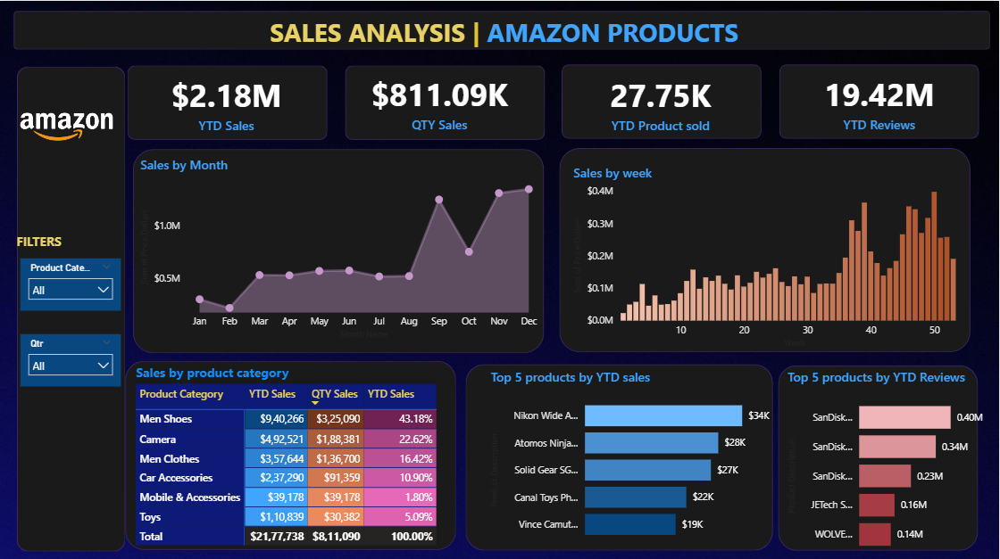

## 📷 Dashboard Preview

# 📊 Amazon Sales Analysis Dashboard

---

## 📌 Project Overview

The **Amazon Sales Analysis Dashboard** is an interactive **Power BI project** that analyzes Amazon product sales data to uncover insights related to **sales performance, product categories, customer engagement, and seasonal trends**.

The dashboard helps transform raw sales data into **actionable business insights using data visualization and analytics techniques**.

---

## 🎯 Project Objectives

✔ Analyze overall **Amazon sales performance**  
✔ Identify **top-performing product categories**  
✔ Track **monthly and weekly sales trends**  
✔ Discover **top-selling products**  
✔ Analyze **customer engagement using reviews**

---

## 🛠 Tools & Technologies

| Tool | Purpose |
|-----|------|
| Power BI | Dashboard & Data Visualization |
| Power Query | Data Cleaning & Transformation |
| DAX | Calculations & Measures |
| Excel / CSV | Dataset Source |

---

## 📊 Dashboard Features

### 📌 Key Performance Indicators (KPIs)

| Metric | Value |
|------|------|
| 💰 YTD Sales | $2.18M |
| 📦 Quantity Sold | 811.09K |
| 🛍 Products Sold | 27.75K |
| ⭐ Total Reviews | 19.42M |

These KPIs provide a **high-level overview of business performance**.

---

### 📈 Sales Trends Analysis

#### 📅 Monthly Sales Trend
A line chart visualizes sales performance across months.

**Insights**
- Sales increase towards the **end of the year**
- **November and December** show the highest demand due to seasonal sales

---

#### 📊 Weekly Sales Trend
Weekly analysis helps identify **demand fluctuations and peak sales periods**.

---

### 🏷 Category Analysis

Product categories analyzed include:

- 👟 Men Shoes  
- 📷 Camera  
- 👕 Men Clothes  
- 🚗 Car Accessories  
- 📱 Mobile & Accessories  
- 🧸 Toys  

📌 **Men Shoes contribute the highest revenue share.**

---

### 🏆 Top Products

The dashboard highlights:

- **Top 5 Products by Sales**
- **Top 5 Products by Reviews**

These visuals help identify **high-performing and highly demanded products**.

---

## 🎛 Interactive Filters

Users can explore data dynamically using:

- **Product Category Filter**
- **Quarter Filter (Q1 – Q4)**

This makes the dashboard **fully interactive and user-friendly**.

---

---

## 💡 Key Insights

📌 **Men Shoes generate the highest revenue among categories**  
📌 Sales significantly increase during **Q4 (Oct – Dec)**  
📌 Products with higher reviews often show **strong customer demand**  
📌 Seasonal shopping events influence **sales spikes**

---
## 📂 Project Structure

Amazon-Sales-Analysis-PowerBI  
│  
├── Amazon_Sales_Dashboard.pbix  
├── dataset.xlsx  
├── dashboard.png  
└── README.md  

---

## 👨‍💻 Author

**Pathan Asmathulla Khan**

🎓 B.Tech CSE (AI & ML)  
🏫 PSCMR College of Engineering and Technology  

🔗 LinkedIn  
www.linkedin.com/in/asmathulla-khan  

💻 Skills  
`Python` • `SQL` • `Power BI` • `Tableau` • `Data Analysis`

---

⭐ If you like this project, consider giving it a star on GitHub!

